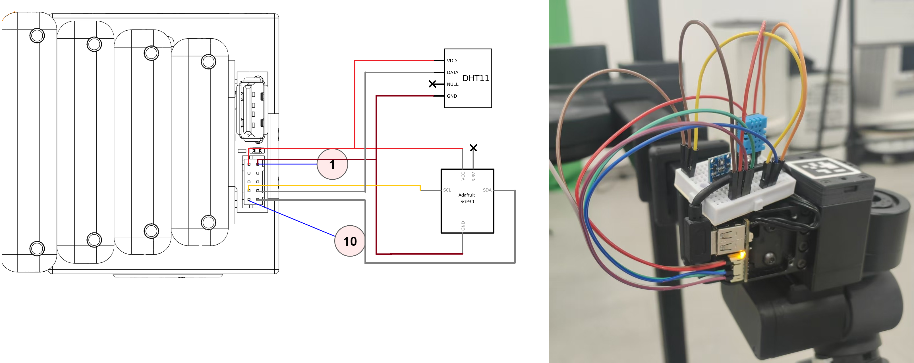
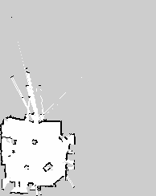
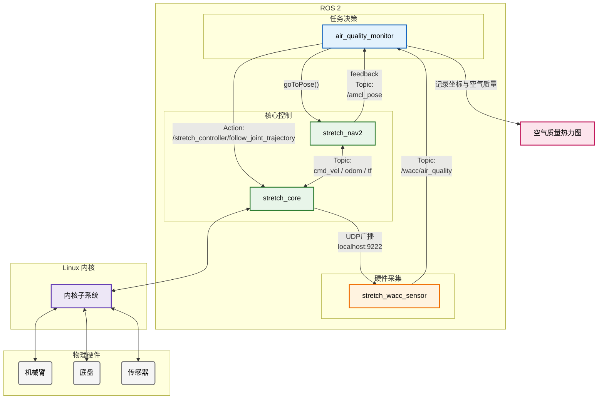

# Stretch Air Quality Monitor

<!-- Badges -->
[](https://docs.ros.org/en/humble/)
[]()
[](https://opensource.org/licenses/bsd-2-clause)

> **简介**：该项目基于 ROS 2 和 Hello Robot Stretch 3 ，利用扩展的 DHT11 和 SGP30 传感器实现了一个轻量级全自动室内环境（温湿度、TVOC、eCO2）巡检与热力图生成系统。


---

## 📑 目录
- [✨ 项目特性](#-项目特性)
- [🛠️ 硬件依赖](#️-硬件依赖)
- [💻 环境配置](#-环境配置)
- [🚀 快速启动](#-快速启动)
- [🏗️ 系统架构](#️-系统架构)
- [👤 团队成员](#-团队成员)

---

## ✨ 项目特性
- **全自动覆盖巡检**：基于 OpenCV 的地图解析，自动计算安全边界并生成弓字形避障巡检网格点。
- **多源传感器融合**：整合 DHT11 和 SGP30 传感器，通过自定义 ROS 消息接口实现时间戳严格对齐。
- **自适应巡检路线**：根据采样数据规划巡检线路，在数据变化迅速区域密集采样，全程无需用户控制。
- **空气数据可视化**：自动插值渲染，生成覆盖在 2D 栅格地图上的室内空气质量热力图。

---

## 🛠️ 硬件依赖
*   **机器人底盘**: Hello Robot Stretch 3 (RE3)
    *   官方文档：[docs.hello-robot.com](https://docs.hello-robot.com/0.3)
*   **扩展传感器**: 
    *   温湿度: DHT11
    *   空气质量: SGP30
*   **连接方式**：按下图所示连接，详细信息参考 [Wrist Expansion Header](https://docs.hello-robot.com/0.3/extending_stretch/extending_stretch_additional_hardware/#wrist-expansion-header)



---

## 💻 环境配置

### 1. 软件先决条件
- **操作系统**: Ubuntu 22.04 LTS
- **ROS 版本**: ROS 2 Humble
- **依赖包**: stretch_core, stretch_nav2

### 2. 克隆代码仓库
终端执行以下命令：

```bash
git clone --recurse-submodules https://github.com/New-Wheat/Stretch_air_quality_monitor

cd ./Strehch_air_quality_monitor
```

### 3. 传感器支持
首先在 Stretch 3 上安装并启动 [Arduino IDE](https://www.arduino.cc/en/software/#ide)

在 **选择开发板** 中选择 **Hello Wacc** （通常是 /dev/hello-wacc 或 /dev/ttyACM5），开发板型号为 Arduino Zero

在菜单栏的 **文件** 中选择 **打开...** ，选择项目目录下 ./firmware/stretch_firmware/arduino/hell_wacc/hello_wacc.ino

加载项目文件后，点击 **上传** 图标，等待固件编译烧录

固件编译烧录完成后，机器人腕部扩展接口处指示灯应以 1Hz 频率闪烁，表明此时固件烧录成功

终端执行以下命令：

```bash
cp ./firmware/wacc_sensor_lib.py ${HELLO_FLEET_PATH}/${HELLO_FLEET_ID}/

echo 'export PYTHONPATH="${PYTHONPATH}:${HELLO_FLEET_PATH}/${HELLO_FLEET_ID}"' >> ~/.bashrc

source ~/.bashrc
```

按照仓库中的 [stretch_user_params.yaml](https://github.com/New-Wheat/Stretch_air_quality_monitor/tree/master/firmware/stretch_user_params.yaml) 修改 ${HELLO_FLEET_PATH}/${HELLO_FLEET_ID}/stretch_user_params.yaml ，样例如下：

```yaml
robot:
  use_collision_manager: 0
  custom_wacc:                          # 需要增加
    py_module_name: 'wacc_sensor_lib'   # 需要增加
    py_class_name: 'WaccSensor'         # 需要增加
pimu:
  config:
    stop_at_runstop: 0
```

### 4. 安装 ROS2 软件包
终端执行以下命令：

```bash
cp -r ./packages/* ~/ament_ws/src/

cd ~/ament_ws/

colcon build

source ./install/setup.sh
```

**注意**：如果执行 `colcon build` 时提示找不到某一头文件（以 .hpp 结尾），在源代码中将 .hpp 改为 .h 即可

---

## 🚀 快速启动

请将 Stretch 3 机器人安放在固定的安全位置，此后机器人的任务都将以此为起始位置，在任务执行完毕后自动归位。如果位置变化则需重新建图，否则可能影响机器人正常工作。

### 1. 建图
安全起见，在执行建图前让机器人收起夹爪和手臂。终端执行以下命令：

```bash
stretch_robot_stow.py
```

在三个终端中，分别执行以下命令：

```bash
ros2 launch stretch_nav2 online_async_launch.py
```
```bash
ros2 run explore_lite explore --ros-args --params-file ~/ament/src/m-explore-ros2/explore/config/params.yaml
```
```bash
# 注意：这条命令会启动 rviz2 ，要求在图形环境中执行
ros2 launch stretch_nav2 navigation.launch.py
```

此时建图开始，机器人会自动探索房间完成建图，在启动的 rviz2 窗口中可以看到正在生成的 2D 地图。待可进入区域遍历完成后，机器人会自动返回起始位置。此时在 **新的** 终端中，执行以下命令以保存地图：

```bash
# 注意：<map_path> 和 <map_name> 需要根据用户喜好自行设定
ros2 run nav2_map_server map_saver_cli -f <map_path>/maps/<map_name>
```

完成后，即可在所有仍有进程运行的终端中按下 Ctrl + C 终止。至此建图步骤结束，用户可以使用图像查看器查看保存的 .pgm 地图，样例地图如下：



其中白色为可通过区域，黑色为障碍物，灰色为未探索区域。

### 2. 巡检监测
终端执行以下命令：

```bash
# 注意：<map_path> 和 <map_name> 需要与先前保存地图时一致
ros2 launch air_quality_monitor monitor.launch.py map:=<map_path>/maps/<map_name>
```

*air_quality_monitor 软件包接受多个运行参数，详细信息见下：*

|参数名称|类型|含义|默认值|可选值/范围|
|:------|:---|:--|:----|:---------|
|map|str|地图 .yaml 文件路径，此为**必填**参数|""|任意有效路径|
|heatmap_type|int|热力图指标类型，0=温度、1=湿度、2=TVOC、3=eCO₂|3|0 / 1 / 2 / 3|
|use_rviz|str|是否启动 rviz2 可视化导航，只可在图形环境中设为 "true"|"false"|"true" / "false"|
|settle_time|float|到达采样点后等待空气稳定的时间（秒）|2.5（launch）/ 3.0（代码默认）|>0|
|min_samples|int|每个点采集最少样本数|5|>=1|
|max_samples|int|每个点采集最多样本数|10|>=1|
|max_collect_sec|float|单点采样最大时间限制（秒）|15.0|>0|
|sample_period_sec|float|采样轮询间隔（秒）|1.0|>0|
|stable_window|int|判断指标稳定性的样本数|4|>=1|
|metric_sigma_threshold|float|样本稳定性标准差阈值；<=0 时使用代码默认值|-1.0|>0 或 -1|
|metric_ci_threshold|float|样本稳定性置信区间阈值；<=0 时使用代码默认值|-1.0|>0 或 -1|
|metric_slope_threshold|float|样本稳定性斜率阈值；<=0 时使用代码默认值|-1.0|>0 或 -1|
|initial_x|float|初始化机器人在地图坐标系中的 x 位置（米）|0.0|任意地图内坐标|
|initial_y|float|初始化机器人在地图坐标系中的 y 位置（米）|0.0|任意地图内坐标|
|initial_yaw|float|初始化机器人朝向（弧度）|0.0|任意角度|
|adaptive_stride|float|自适应路线网格步长（米）|0.8（launch）/ 0.6（代码默认）|>0|
|adaptive_top_k|int|达成候选点排序后选取的前 K 个目标点数量|15（launch）/ 20（代码默认）|>=1|
|adaptive_min_distance|float|自适应目标与当前位姿的最小距离（米）|0.8（launch）/ 0.6（代码默认）|>=0|
|adaptive_travel_weight|float|自适应评分中距离权重|0.25|0.0〜1.0|
|adaptive_grad_weight|float|自适应评分中梯度权重|0.6|0.0〜1.0|
|idw_power|float|反距离权重插值 (IDW) 的幂指数|2.0|>0|
|auto_tune_idw_power|bool|是否自动调优 IDW 幂指数|true|"true" / "false"|
|idw_power_candidates|str|IDW 可选幂指数列表，逗号分隔|"0.5,1.0,1.5,2.0,2.5,3.0,4.0"（launch）/ 默认代码值更广|逗号分隔数值列表|

正常情况下，机器人会自动巡检房间中的区域完成采样，巡检完毕后会自动返回起始位置，此时即可在当前终端所在目录下查看渲染的热力图，样例如下：


---

## 🏗️ 系统架构

本项目采用软硬件解耦、多节点分布式的 ROS 2 架构设计，主要分为硬件采集层、ROS 2 核心控制层和任务决策层。

### 1. 硬件拓扑
传感器数据采集与机器人主机的物理连接链路：
* **环境感知终端**：DHT11（温湿度）与 SGP30（空气质量）传感器。
* **数据采集板**：机器人手腕处内置Arduino Zero，负责底层时序控制与 I2C 通信，每 1Hz 向主机发送聚合数据。
* **计算平台**：Hello Robot Stretch 3 内部的 Intel NUC 主机。

### 2. ROS 2 节点通信图
以下是系统运行时的核心节点与 Topic/Action 交互拓扑关系：



### 3. 核心数据流说明
1. **数据同步**：`udp_processor` 节点读取串口数据，将其打包为自定义的 `AirQuality.msg`，解决多传感器数据时间不对齐的问题。
2. **任务调度**：`monitor` 作为中央指挥官，调用 Nav2 API 控制机器人移动到指定网格点。
3. **定点采集**：到达目标点后，`monitor` 节点阻塞导航线程，同时后台订阅线程持续缓存空气质量数据，最终取平均值以消除传感器噪声。
4. **结果渲染**：遍历结束后，结合 `map_server` 的 2D 栅格地图与收集到的 (X, Y, Value) 数组，利用 OpenCV 生成 IDW 插值的平滑热力图。

---

## 👤 团队成员

此项目属于复旦大学计算与智能创新学院曦源项目，非常感谢 [董震老师](https://cs.fudan.edu.cn/dz/) 为本项目提供支持。

项目开发成员：

<table>
  <tr>
    <td align="center"><a href="https://github.com/zhendong2050"><br /><sub><b>Zhen Dong</b></sub></a><br />导师</td>
    <td align="center"><a href="https://github.com/New-Wheat"><br /><sub><b>NewWheat</b></sub></a><br />组长</td>
    <td align="center"><a href="https://github.com/AssassinCow"><br /><sub><b>Aerondight</b></sub></a><br />组员</td>
</table>
